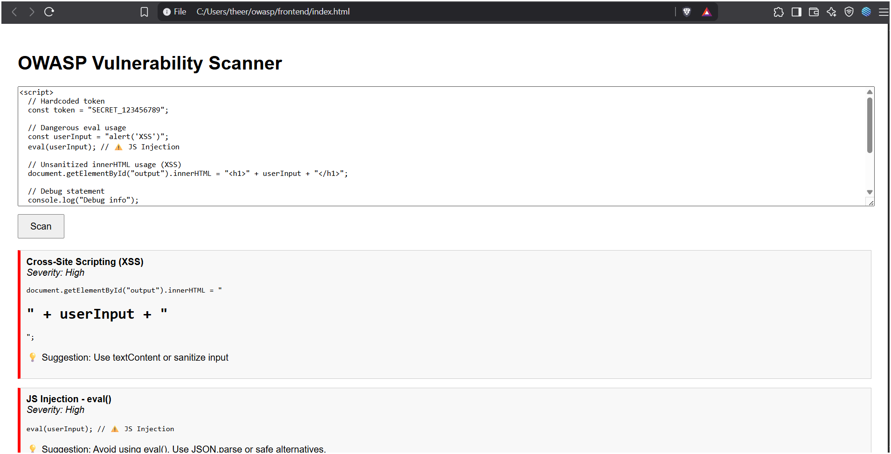

# 🛡️ OWASP Vulnerability Scanner


A lightweight 🔍 web-based tool to detect common vulnerabilities in HTML and JavaScript code snippets, based on the **OWASP Top 10** security risks. This project helps developers and students identify issues like XSS, injection flaws, open CORS policies, and more — encouraging secure coding habits through real-time feedback.

---

## 🚀 Features

- ✅ Detects common OWASP Top 10 issues:
  - ❌ Cross-Site Scripting (XSS)
  - ❌ Injection attacks (e.g., `eval`, SQL patterns)
  - ❌ Open CORS policy
  - ❌ Hardcoded credentials
- 🧠 Uses static code analysis and pattern matching
- 📄 Simple HTML/JS paste-and-scan interface
- 📦 Built with Python Flask & BeautifulSoup

---

## 📸 Screenshots

### 🔍 Sample Vulnerability Scan


## 🛠️ Tech Stack

[](https://developer.mozilla.org/en-US/docs/Web/HTML)  
[-blueviolet)](https://flask.palletsprojects.com/)  
[](https://www.crummy.com/software/BeautifulSoup/)  
[](https://pypi.org/project/Flask-Cors/)

## 📦 Requirements

Install the following dependencies before running:

```bash
pip install flask flask-cors beautifulsoup4 lxml
```
## 💻 How to Run

Follow these steps to set up and run the OWASP Vulnerability Scanner locally:

### 1️⃣ Clone the Repository

```bash
git clone https://github.com/your-username/owasp-scanner.git
cd owasp-scanner
```
### 2️⃣ Install Python Requirements
Make sure you have Python installed. Then, install the required libraries:

```bash

pip install -r requirements.txt

```
### 3️⃣ Start the Backend Server
Navigate to the backend directory and run the Flask server:

```bash

cd backend
python app.py
```
 The backend will start at http://localhost:5000.

### 4️⃣ Start the Frontend

- Open the index.html file directly in your web browser:

- On Windows: Double-click the index.html file.

- On Mac/Linux: Right-click and choose “Open with browser.”

- Or you can drag and drop the file into your browser window.

📌 Note: Make sure the backend is running before you test the frontend scanner!


